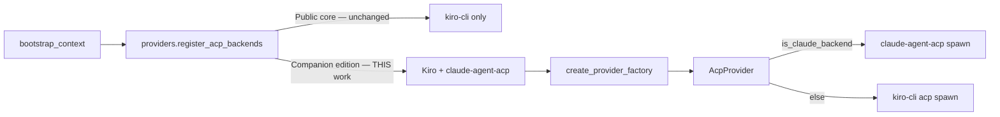

# Claude ACP Backend Enablement — Task List

> **Status: planning.** Not started. This is a working task list for activating
> the dormant `ACP_BACKEND_CLAUDE` seam in a **companion edition**, not a change
> to the public core.
>
> **Related:** [`claude-code-provider.md`](./claude-code-provider.md) (the "removed
> provider" record + dormant seam description), [`../modules/acp-client.md`](../modules/acp-client.md)
> (the companion integration contract).

## Context — why this is small, not large

KiroCrew already ships an **~11,200-line ACP layer** (`src/kiro_crew/acp/`) that is
backend-agnostic by design. `AcpClient` already branches on `self._is_claude` in
~15 places, the binary resolver `_resolve_claude_acp_bin` is fully implemented
(env var → vendored → mise → PATH), `model_registry.json` already carries Claude
models under the `claude_code` namespace, and `AcpProvider.is_claude_backend` is
wired through `providers/acp.py`.

What's missing is the **activation glue** that the public core deliberately
deleted (the `cc_agent` module + the `_write_claude_local_settings` /
`_claude_acp_mcp_servers` methods + a `ProviderRegistry` that re-registers the
backend). The repo's stated rule: *"Do not re-add the registration glue or a
provider selector in the public core"* — so this lives in a **companion package**.



## Scope boundaries

- **In scope:** activate the Claude backend end-to-end; make it selectable; pass
  the acceptance tests below.
- **Out of scope (deliberately):** modifying the public core's
  `DefaultProviderRegistry`, re-adding a provider selector to the dashboard, or
  restoring the deleted standalone provider. The companion re-registers via the
  seam; the core stays single-backend.
- **Known limitation to accept:** Claude backend is **not** session-sharing
  eligible (`AcpProvider.is_session_sharing_eligible` returns `False`), so
  subagents fall back to the legacy one-process-per-session path. Not a blocker.

## Phases

### Phase 0 — Companion skeleton & binary provisioning

Goal: a companion package loads at boot and can spawn `claude-agent-acp`.

- [ ] **T0.1** Create the companion package skeleton (e.g. `kiro_crew_cc/` or an
      external dist), with a `ProviderRegistry` override that calls
      `register_acp_backends()` to re-register the Claude backend via the
      `_is_claude` seam. Mirror the shape documented in
      `platform/interfaces.py` → `ProviderRegistry.register_acp_backends`.
- [ ] **T0.2** Provision `claude-agent-acp`. Decide: vendored into the dist
      bundle (the `_vendor/node_modules` path the docs describe, with the **full
      transitive closure** including `@agentclientprotocol/sdk`), **or**
      `npm i -g @agentclientprotocol/claude-agent-acp` at runtime. Vendoring is
      what the deleted `setup.py` hook (`_vendor_acp_into_pkg`) did — re-add that
      hook if vendoring. **Verify the dependency-closure marker**:
      `_resolve_vendored_claude_acp` rejects a vendored copy missing
      `@agentclientprotocol/sdk`, so an incomplete copy is silently skipped.
- [ ] **T0.3** Resolve the **native Claude binary** → `CLAUDE_CODE_EXECUTABLE`.
      The adapter SDK does NOT search PATH for `claude`, and bundling the
      ~250 MB per-platform native binary is not viable. Wire
      `_resolve_claude_code_executable()` (override → `mise which claude` →
      augmented PATH incl. `~/.toolbox/bin`). If unresolved, leave unset and let
      the adapter's `Claude native binary not found` error surface (do **not**
      guess a bad path).
- [ ] **T0.4** Smoke test: boot the companion, spawn a Claude session, confirm
      the `initialize` handshake completes with `protocolVersion: 1` (integer —
      NOT the kiro date string `2025-08-22`). Confirm `session/new` does not fail
      with the native-binary error.

### Phase 1 — Per-session settings seed (the 1M-token unlock)

Goal: Claude sessions run at full context and route every tool decision back to
KiroCrew. **This is the fragile critical path** — get it wrong and sessions
silently collapse to 200K.

- [ ] **T1.1** Re-add `_write_claude_local_settings()` as a method on `AcpClient`
      (the client already `getattr`-calls it guardedly at spawn, so the call site
      exists). It must write `<work_dir>/.claude/settings.local.json` with:
      - `permissions.defaultMode` — `default` (per-tool approval) or `auto`
        (SDK auto-accept). Use the canonical vocab in `acp/types.py`
        (`CC_PERMISSION_MODE_DEFAULT` / `CC_PERMISSION_MODE_AUTO`).
      - `availableModels` allowlist — **this is what unlocks the 1M-token
        window.** Without it, Claude collapses to the 200K default.
- [ ] **T1.2** **Run on EVERY primary spawn path**, not only the rare
      model-substitution retry. The client already warns about this
      (`_spawn` docstring). Verify both the first-spawn site and the
      `_new_session_following_substitution` re-seed site
      (`_write_claude_local_settings` is referenced at L1795 and L2246).
- [ ] **T1.3** Set `CLAUDE_CONFIG_DIR=<config_dir>/cc-config` (isolated config
      root) so the adapter's `SettingsManager` reads KiroCrew's seeded settings
      instead of the user's global `~/.claude`. Keep creds/models, strip plugins.
      Disable with `KIROCREW_CC_ISOLATE=0` for debugging.
- [ ] **T1.4** Acceptance: send a prompt that would exceed 200K tokens of
      context (large file read) and confirm it does NOT fail with a context
      overflow. This proves the allowlist landed.

### Phase 2 — MCP server injection (Claude ignores `--agent`)

Goal: Claude sessions get the same MCP tools as kiro sessions.

- [ ] **T2.1** Re-add `_claude_acp_mcp_servers()` on `AcpClient`. Unlike kiro-cli
      (which reads MCP from the agent config), `claude-agent-acp` reads **no
      config file** — so `session/new` AND `session/load` must carry servers in
      the `mcpServers` param.
- [ ] **T2.2** Re-add the translation helper (the deleted `cc_agent` module's
      `acp_servers_from_cc_map`): read KiroCrew-owned
      `~/.claude/agents/kirocrew.mcp.json` and reshape to the ACP array —
      stdio → `{name, command, args, env:[{name,value}], type}`,
      url → `{name, type:"http"|"sse", url, headers}`.
- [ ] **T2.3** Force `kirocrew-core` and `kirocrew-cron` to their canonical
      stdio command (overriding any stale `url`) and always inject them even when
      the registry is missing.
- [ ] **T2.4** Re-add `agent.install_cc_agent_config` to keep
      `~/.claude/agents/kirocrew.mcp.json` current (read per-spawn so MCP
      installs/toggles apply on the next session without a gateway restart).
- [ ] **T2.5** Acceptance: spawn a Claude session, call an MCP tool from the
      dashboard, confirm it executes.

### Phase 3 — Selection surface

Goal: a user/operator can actually choose the Claude backend.

- [ ] **T3.1** Plumb `acp_backend` through `create_provider_factory` in
      `config/loader.py`. **Currently the `_acp` factory never passes
      `acp_backend`** (L5263), so it always defaults to kiro. The companion's
      factory override must thread `acp_backend="claude"` (or read it from a
      config field) into `AcpProvider(...)`.
- [ ] **T3.2** Decide the selection UX (companion decision, not core):
      config-file field, env var (`KIROCREW_ACP_BACKEND=claude`), per-channel
      override, or per-session. Document the chosen mechanism. **Do not** add a
      provider selector to the public dashboard.
- [ ] **T3.3** Verify `AcpProvider.is_claude_backend` propagates correctly to all
      ~15 branch points in `providers/acp.py` (effort via
      `session/set_config_option` not overlay; model via
      `session/set_config_option` not `set_model`; `set_mode` skipped; etc.).

### Phase 4 — Permission flow parity

Goal: Claude sessions use the same approve/trust/yolo protocol as kiro.

- [ ] **T4.1** Verify `_build_permission_event` handles the Claude
      `optionId`/`name` field names (vs kiro `id`/`label`). Already implemented —
      confirm with a live permission prompt.
- [ ] **T4.2** Verify `reject_tool` sends the **clean reject** (advertised reject
      optionId → `outcome: "selected"`) rather than `cancelled`, which makes
      `claude-agent-acp` throw the cryptic `Error("Tool use aborted")`. Already
      implemented — confirm.
- [ ] **T4.3** Confirm KiroCrew's `HooksConfig.auto_deny_tools` still fires on
      every `session/request_permission` event (the security invariant — Claude
      must not bypass `auto_deny_tools` / sensitive-path checks / credential
      redaction).
- [ ] **T4.4** Verify unknown server→client requests (e.g. `fs/read_text_file`,
      `terminal/create`) get `-32601 method not found` rather than hanging the
      turn. Already implemented via `_reject_unknown_server_request` — confirm.

### Phase 5 — E2E acceptance & hardening

Goal: the Claude backend is production-usable across all KiroCrew surfaces.

- [ ] **T5.1** **E2E: dashboard chat** — full conversation, tool approval, model
      switch, effort change (via `session/set_config_option`).
- [ ] **T5.2** **E2E: channel agent** (Slack/Telegram/WeCom) — Claude backend
      over a channel.
- [ ] **T5.3** **E2E: subagent** — confirm the legacy per-process path works
      (Claude is not session-sharing eligible; verify it does NOT try to use the
      multiplexed `AcpRuntime`).
- [ ] **T5.4** **E2E: cron + heartbeat** — unattended Claude runs.
- [ ] **T5.5** **E2E: session resume** — `session/load` replays the prior
      transcript as `session/update` notifications before resolving; verify the
      activity-based deadline in `_wait_for_response()` keeps it alive.
- [ ] **T5.6** **Model substitution** — verify the model-substitution advisory
      detection (`_is_model_substitution_advisory`) and the
      `_new_session_following_substitution` retry re-seed settings (T1.2).
- [ ] **T5.7** Pin a `claude-agent-acp` version; the client has lots of
      version-defensive code (older builds lack the `effort` config option, etc.).
      Record the pinned version + native binary requirement in the companion
      install docs.
- [ ] **T5.8** Update `claude-code-provider.md` from "dormant" to "activated by
      the companion" and add a companion install/selection section. Do **not**
      claim the public core supports it.

## Acceptance definition of done

All of:

1. Phases 0–4 complete and verified against a live `claude-agent-acp`.
2. T5.1–T5.6 E2E tests pass.
3. The public core (`DefaultProviderRegistry`, dashboard, `create_provider_factory`
   default path) is **byte-identical** — no core branching added.
4. `auto_deny_tools` / sensitive-path / credential-redaction hooks fire on every
   Claude tool call (T4.3) — security parity proven, not assumed.
5. 1M-token window confirmed (T1.4).
6. Docs updated (T5.8).

## Plugin — `models.dev` context-window resolver (cross-cutting)

> Separable from the Claude backend work. Benefits **both** backends by
> replacing the hand-maintained `window` literals in `model_registry.json`
> with an authoritative, auto-updating source. Land it first as an independent
> PR — the Claude `availableModels` allowlist (Phase 1) then reads real windows
> instead of guesses.

### Why

`model_registry.json` hardcodes `"window": <int>` per model, maintained by
hand. `models.dev/models.json` is a flat dict keyed by `provider/model-id` with
an authoritative `limit.context` field (plus bonus signal: `reasoning`,
`tool_call`, `attachment`, `modalities`, `release_date`). Verified shape:

```jsonc
// GET https://models.dev/models.json  →  { "anthropic/claude-sonnet-4-6": { ... } }
"anthropic/claude-opus-4-8": {
  "limit": { "context": 1000000, "output": 64000 },
  "reasoning": true, "tool_call": true, "attachment": true, ...
}
```

23 Anthropic entries already cover every model in `model_registry.json`.

### Where it slots in

`model_registry.model_window()` (`src/kiro_crew/model_registry.py:421`) has a
fallback chain. The plugin inserts a new tier **above the static registry
literal** so the hand-maintained value is no longer the ceiling:

```
1. live_tokens           (per-turn usage_update — always wins)
2. kiro-list cache       (kiro-cli --list-models)
3. models.dev cache      ← NEW (this plugin)
4. static registry       (model_registry.json window literal)
5. supplementary map     (Bedrock/legacy substring)
6. [1m] heuristic
7. None → REFERENCE_WINDOW_TOKENS (1M, never silent 200K)
```

`window_source()` gains a `"models-dev"` tier in its diagnostic output.

### Tasks

- [ ] **P1** `src/kiro_crew/models_dev.py` — fetch + parse + cache
      `https://models.dev/models.json`. Requirements:
      - **Cached on disk** under the data home (`~/.kiro/crew/models-dev.json`)
        with a TTL (e.g. 24h). Never fetch on the hot prompt path.
      - **Offline-safe:** if the cache is missing/stale and the fetch fails,
        return `None` for every lookup — `model_window()` falls through to the
        static registry unchanged. The plugin must NEVER block or break
        resolution on a network failure.
      - **Lazy + background:** first access triggers a background refresh; the
        foreground resolves off whatever cache exists (or falls through).
- [ ] **P2** Loose model-id matching — users run Claude through custom
      backends (LiteLLM, OpenRouter, proxies, Bedrock with their own id
      aliases), so the id reaching `model_window()` is NOT always a clean
      `anthropic/claude-opus-4-8`. Build a tiered matcher, **most-specific
      first, with explicit ambiguity resolution**, against the cached
      `models.json` keys. Verified collisions in the dataset drive these rules:

      **Normalization (applied to BOTH the query id and every dataset key):**
      - strip provider prefix (`anthropic/`, `bedrock/`, custom)
      - lowercase
      - strip date suffix `-\d{8}` (e.g. `claude-sonnet-4-5-20250929` →
        `claude-sonnet-4-5` — the date is a snapshot, same model/window)
      - strip KiroCrew's `[1m]` / `-1m` variant marker (a capability flag, not
        a different model — it does not change the window)
      - unify dotted↔hyphenated version separators (`claude-opus-4.8` ↔
        `claude-opus-4-8`)
      - drop noise tokens (`latest`, `v`, redundant `claude-`)

      **Match tiers (first hit wins):**
      1. **Exact** after normalization. (e.g. `claude-opus-4-8` →
         `anthropic/claude-opus-4-8`)
      2. **Version-aware**: parse `family` + ordered version tokens
         (`opus` + `[4,8]`). Match a dataset key whose normalized tokens are a
         superset-and-consistent. So `claude-opus-4` matches `claude-opus-4-8`,
         `claude-opus-4-7`, `claude-opus-4-5`, … — but this is **ambiguous**,
         so defer to the tiebreak below rather than guessing.
      3. **Family-only** (`claude-opus`, `claude-sonnet`, `claude-haiku`) —
         always ambiguous across versions; same tiebreak.

      **Tiebreak (when a tier yields >1 candidate):** pick the **latest by
      version then release_date** (`release_date` is in `models.json`). This
      makes `claude-opus` resolve to the newest Opus, which is the sane default
      for a proxy that stripped the version. **Log the match at INFO** with the
      original query id + all candidates considered, so an operator who
      expected a specific older model can see what happened and pin the full id.

      **Return `None` (fall through to static registry) when:**
      - zero candidates after normalization (truly unknown model), OR
      - the latest-by-version tiebreak is itself tied with no `release_date`
        to break it (refuse to guess between co-released variants).

      **MUST NOT** silently resolve a query that matches multiple *families*
      (`claude` alone matches opus/sonnet/haiku/fable) — that returns `None`.
      Cross-family guessing is never safe.

      Reuse `model_registry.json` aliases + `providers.acp` /
      `providers.claude_code` ids as a pre-pass: if the query id is a known
      alias, resolve to the canonical key first, THEN loose-match. This keeps
      the matcher from reinventing KiroCrew's existing id vocabulary.

      Test matrix (must all pass):
      - `claude-opus-4-8` → exact
      - `claude-opus-4.8` → exact (dotted)
      - `global.anthropic.claude-opus-4-8[1m]` → exact (prefix + `[1m]`)
      - `claude-sonnet-4-5-20250929` → exact (date stripped)
      - `claude-opus-4` → latest 4.x opus (ambiguous → tiebreak, logged)
      - `claude-sonnet` → latest sonnet (ambiguous → tiebreak, logged)
      - `claude` → `None` (cross-family, refused)
      - `gpt-4o` → `None` (not anthropic; falls through to kiro-list/static)
      - `my-custom-proxy-claude-opus-4-8` → exact-ish (noise token stripped)
- [ ] **P3** Wire into `model_window()` as tier 3 (above the static registry).
      Add the `"models-dev"` value to `window_source()`.
- [ ] **P4** Tests — F.I.R.S.T.:
      - unit: key normalization across aliases/dotted/hyphenated/`[1m]` variants
      - unit: cache-hit returns window, cache-miss+offline returns `None`
      - unit: TTL expiry triggers refresh, refresh failure is non-fatal
      - integration: `model_window("claude-opus-4-8")` resolves from a fixture
        `models.json` and `window_source()` reports `"models-dev"`
- [ ] **P5** Doc update — `docs/system-specs/modules/` model-registry doc: add
      `models.dev` to the fallback-chain description and note the TTL +
      offline-degrade behavior.
- [ ] **P6** (Optional, follow-on) Feed more than `limit.context` from
      `models.json` into `model_registry.json` generation: `reasoning` →
      `supports_effort`, `reasoning_options[].values` → valid effort levels,
      `release_date` for display. A `scripts/sync-models-dev.py` that proposes
      JSON edits (reviewed, not auto-applied) keeps humans in charge.

### Acceptance

- `model_window()` for any Anthropic model returns the `models.dev` value when
  the cache is fresh, WITHOUT a network hit on the prompt path.
- Killing the network entirely changes nothing (falls through to static
  registry); no exception, no hang.
- `window_source()` reports `"models-dev"` for a freshly-cached model.

## Open questions

- **Q1** Vendoring vs. global npm install for `claude-agent-acp` (T0.2)?
  Vendoring matches the deleted design and works on hosts with no registry token,
  but re-adds the `setup.py` build hook + closure-copy logic. Decide based on
  target deployment (always-on server vs. desktop).
- **Q2** Selection UX (T3.2): global default, per-channel, or per-session? Affects
  how much config plumbing the companion owns.
- **Q3** Does the target deployment already have a native `claude` binary
  available (T0.3), or does the companion need to document/install one? The
  ~250 MB per-platform binary cannot be vendored reasonably.

## Effort estimate

**~1 week** for one engineer who reads `acp-client.md` first. The protocol
client, dispatch, types, model registry, and provider branching are already
written and maintained (recent `fix(acp):` commits keep fixing Claude-specific
edge cases). Phases 1 and 2 are the bulk of the work (re-adding deleted glue);
0, 3, 4, 5 are integration + verification.
