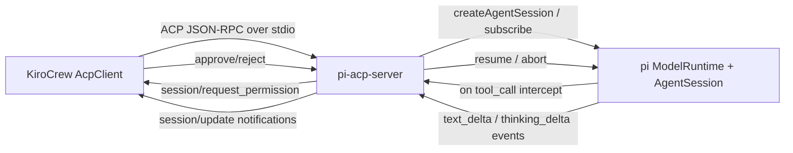

# Pi ACP Server — KiroCrew Backend Connector

> **Status: planning.** Not started. This is the design + task list for running pi
> as a **third ACP backend** that KiroCrew can drive, alongside `kiro-cli` and
> `claude-agent-acp`.
>
> **Direction chosen:** A — pi **as an ACP server**. KiroCrew drives pi.
>
> **Related:** [`claude-backend-enablement.md`](./claude-backend-enablement.md)
> (the Claude activation work — same companion seam, different backend).

## What this is

A standalone adapter package — `pi-acp-server` — that wraps pi's `ModelRuntime` +
`AgentSession` behind the **Agent Client Protocol** (JSON-RPC 2.0 over stdio),
so KiroCrew's `AcpClient` (`src/kiro_crew/acp/client.py`) can spawn and drive it
exactly as it drives `kiro-cli acp` and `claude-agent-acp`.



## Why it's a real build (not a wrapper)

ACP is a full bidirectional server protocol. Pi has **no ACP surface today** — it
has an SDK with streaming events, tool-call interception, and abort, but no
JSON-RPC server, no `session/request_permission` outbound channel, no
`session/update` notification stream, and no `initialize`/`session/new`/`set_mode`
handshake. This adapter is the bridge. Concretely it must:

1. Implement the **ACP server side** of the JSON-RPC methods KiroCrew's client
   calls (see `acp-client.md` "Protocol Flow"):
   `initialize` → `session/new`/`session/load` → `set_mode` → `set_model` →
   `session/prompt` → `cancel`, plus the `session/update` notification family.
2. Emit **outbound** `session/request_permission` requests and block the pi turn
   until KiroCrew replies (the approve/reject round-trip).
3. Translate pi's event stream into ACP `session/update` notifications.
4. Bridge MCP: accept KiroCrew's `mcpServers` in `session/new` and register them
   with pi's tool layer.

## Feasibility — confirmed against pi's SDK (Q1 resolved ✅)

Pi's `AgentSession` exposes every primitive ACP needs. **The make-or-break
question (Q1 — can the tool hook async-block pending an external reply?) is
answered YES.** Verified directly in pi's shipped source:

### Q1: async-blocking permission gate — WORKS as-is

The chain, source-confirmed:

1. **`pi-agent-core`'s agent loop** (`agent-loop.js:405-419`) calls
   `await config.beforeToolCall({...}, signal)` **before** every tool executes,
   and the `await` means the turn is suspended for as long as the hook's Promise
   is unresolved.
2. **`AgentSession._installAgentToolHooks`** (`agent-session.js:215`) wires
   `this.agent.beforeToolCall = async ({toolCall, args}) =>
   await runner.emitToolCall({...})`.
3. **`ExtensionRunner.emitToolCall`** (`runner.js:698`) loops `await handler(...)`
   over registered `tool_call` handlers — so an extension handler CAN be an
   async function that awaits an external ACP permission reply for an
   arbitrary duration.
4. **`ToolCallEventResult = { block?: boolean; reason?: string }`** — the
   handler returns `{block: true, reason: "..."}` to deny, or `undefined`/nothing
   to allow. `emitToolCall` short-circuits on the first `block: true`.

**How a block surfaces (verified `agent-loop.js:419`):** a blocked tool becomes
an **error `tool_result`** (`createErrorToolResult(reason)`) returned to the
model — the turn continues, the model sees the denial. This is **exactly** ACP-
correct: a rejected tool surfaces to the agent so it can react. The turn does
NOT abort.

**Cancel through the gate (verified `agent-loop.js:414`):** `signal?.aborted` is
checked immediately after the hook's `await` resolves. So when KiroCrew sends
`cancel`, pi's abort signal fires, the hook resolves, and the loop returns an
`"Operation aborted"` result cleanly — cancel composes with the permission
round-trip for free.

**Implication:** the pi-acp-server's permission handler is just:
```typescript
session.on("tool_call", async (event) => {
  const reqId = nextPermissionId();
  sendRequest("session/request_permission", { id: reqId, toolCall: event, options: [...] });
  const reply = await pendingPermissions.get(reqId)!;  // blocks the turn
  if (reply.outcome === "deny") return { block: true, reason: reply.reason };
  // else allow
});
```
No upstream pi changes needed. Phase 2 is mechanical, not risky. **Strike the
"1-2 weeks for an extension-API contribution" caveat from the effort estimate.**

### Remaining surface mapping

| ACP need | Pi surface | Notes |
|---|---|---|
| Text streaming | `event.assistantMessageEvent.type === "text_delta"` | → `session/update` `agent_message_chunk` |
| Reasoning streaming | `thinking_delta` | → `agent_thought_chunk` |
| Tool calls | `on("tool_call")` + `beforeToolCall` async hook | **confirmed async-blockable** (above) |
| Cancel | `session.abort()` + abort `signal` | composes with the permission gate |
| Model select | `on("model_select")` / model param at session create | → `set_model` / `set_config_option` |
| MCP tools | `registerTool()` extension API | `session/new.mcpServers` → register as pi tools |

The `permission-gate.ts` extension example (`on("tool_call")`, `ui.confirm`) is
the template — except instead of `ui.confirm`, we emit the ACP request and
await the JSON-RPC reply.

## Scope boundaries

- **In scope:** a faithful-enough ACP server that KiroCrew's `AcpClient` (the
  *kiro-cli* backend path, NOT the dormant Claude path) can spawn it, run a
  prompt, approve tools, and cancel. Phase 1 = single-session stdio. Session
  resume (`session/load`), subagent multiplexing, and MCP forwarding are
  follow-ons.
- **Out of scope (Phase 1):** `session/load` transcript replay, multi-session
  demux (pi would be one-process-per-session like the Claude backend, NOT
  session-sharing eligible — see `claude-backend-enablement.md`), the
  `clientCapabilities` `elicitation`/`fs`/`terminal` channels.
- **KiroCrew side is tiny:** register `pi` as a backend id via the same
  companion seam (`ProviderRegistry.register_acp_backends`) and thread
  `acp_backend="pi"` to the factory. The `AcpClient` already branches on backend;
  a `"pi"` branch is a few lines (spawn `pi-acp-server` instead of `kiro-cli`).

## Protocol contract (what KiroCrew expects — non-negotiable)

From `docs/system-specs/modules/acp-client.md` + source-verified in
`src/kiro_crew/acp/client.py`. The adapter MUST satisfy these or KiroCrew's
client misbehaves. **All four open questions are now resolved (see Open
Questions) — this contract is build-ready.**

**Framing (Q2):** newline-delimited JSON-RPC, one object per `\n`, symmetric.
Read with `readline()`, send with `json.dumps(msg) + "\n"`. No Content-Length.

1. **`initialize`** — accept `protocolVersion`. Use the **integer** form
   (`1`, like claude-agent-acp, `client.py:128 PROTOCOL_VERSION_CLAUDE = 1`),
   NOT kiro's date string (`2025-08-22`). Respond with `agentCapabilities.loadSession: false`
   (Q4 — makes KiroCrew skip `session/load` entirely), plus `modes` and the
   `configOptions` you support (at minimum `{id: "model"}`).
2. **`session/new`** — accept `cwd`, `mcpServers` (Phase 2; Phase 1 may ignore),
   respond `{sessionId, modes: [{modeId: "pi", name: "Pi"}]}`. The `modes` field
   only feeds the dashboard dropdown (Q3).
3. **`set_mode`** — **skippable.** Declare it in `modes` but pi need not honor a
   `modeId`; KiroCrew's claude path proves skipping is safe (`client.py:2400`).
   No-op-accept is fine.
4. **`set_model` / `set_config_option(configId:"model")`** — translate to pi's
   model selection. Mirror claude-agent-acp (config option, not kiro's
   set_model) unless pi exposes a cleaner seam.
5. **`session/prompt`** — the core. Stream `session/update` notifications:
   - `agent_message_chunk` (from `text_delta`)
   - `agent_thought_chunk` (from `thinking_delta`)
   - `tool_call` / `tool_call_update` / `tool_result`
   - `usage_update` (if pi exposes token counts)
   Resolve the prompt request only when the pi turn ends (`stop_reason`).
6. **`session/request_permission`** (server→client REQUEST, with an `id`) — emit
   for every tool call via pi's `on("tool_call")` async hook (Q1 — confirmed
   blockable). **Must await KiroCrew's reply** before the hook resolves.
   KiroCrew replies `{outcome: {outcome: "selected", optionId: ...}}` or
   `cancelled`. Use optionIds `allow_once`/`allow_always`/`reject_once`/
   `reject_always` (the spec form, like claude-agent-acp). On deny, the hook
   returns `{block: true, reason}` → pi surfaces an error `tool_result` to the
   model (turn continues, Q1).
7. **`cancel`** — call `session.abort()`. `signal.aborted` is checked right
   after the permission-hook await (`agent-loop.js:414`), so cancel composes
   with an in-flight permission gate for free. Resolve the in-flight prompt
   with `stop_reason: "cancelled"`.
8. **Unknown server→client requests get a reply, never dropped** — reply
   `-32601 method not found` rather than ignoring (else the turn hangs at
   `_reject_unknown_server_request`).
9. **Request-id discipline** — outbound requests (permission) carry their own id
   counter; a reply is matched by `id` AND `method is None`. Never let a
   permission-request id collide with the in-flight prompt's id.

## Phases

### Phase 0 — Scaffold + handshake

Goal: KiroCrew spawns `pi-acp-server`, `initialize` completes, a session is
created.

- [ ] **T0.1** `pi-acp-server` package skeleton: a Node/TypeScript stdio process
      reading JSON-RPC frames (newline-delimited or Content-Length — match
      whatever KiroCrew's `_read_message` expects; verify in `acp/client.py`).
      Use `@agentclientprotocol/sdk` if it exposes a server helper (it ships the
      client schema; check for a server builder).
- [ ] **T0.2** Implement `initialize` (protocolVersion integer `1`,
      agentCapabilities with `loadSession: false`), `session/new` (create a pi
      `AgentSession` via `createAgentSession` + `ModelRuntime.create()`, return a
      `sessionId` + a fixed `modes` list), `session/load` (return
      `-32601`/unsupported in Phase 1).
- [ ] **T0.3** KiroCrew-side: register a `"pi"` backend id in the companion
      `ProviderRegistry.register_acp_backends()`. Add a `ACP_BACKEND_PI = "pi"`
      constant in `acp/types.py`. Thread `acp_backend="pi"` from the companion
      factory. In `AcpClient._spawn`, add the `pi` branch: resolve the
      `pi-acp-server` binary (mirror `_resolve_claude_acp_bin`'s resolution
      ladder: env var → vendored → PATH). **No public-core branching** —
      companion-only, same seam as the Claude work.
- [ ] **T0.4** Smoke test: boot KiroCrew with the pi backend selected, confirm
      `initialize` + `session/new` succeed and a session id is returned.

### Phase 1 — Single-prompt streaming (the core)

Goal: `session/prompt` streams a full pi turn back to KiroCrew as
`session/update` notifications.

- [ ] **T1.1** Subscribe to the pi `AgentSession` event stream. Map events → ACP
      `session/update` notifications:
      - `text_delta` → `agent_message_chunk`
      - `thinking_delta` → `agent_thought_chunk`
      - tool-call lifecycle → `tool_call` / `tool_call_update` / `tool_result`
      - turn end → resolve the `session/prompt` request with `stop_reason`
        (`end_turn` / `tool_use` if paused on permission / `cancelled`).
- [ ] **T1.2** Verify KiroCrew's dashboard renders the streamed chunks live (it
      consumes `EVENT_TEXT_CHUNK` / `EVENT_THINKING_CHUNK` from `_dispatch.py` —
      confirm the notification shapes match `_dispatch`'s parser, not just the
      spec).
- [ ] **T1.3** Usage: if pi exposes token counts per turn, emit `usage_update`
      (`size` field — KiroCrew's `model_window` treats live `usage_update.size`
      as the highest-priority window source). If pi doesn't expose counts,
      omit (KiroCrew falls back to the registry).

### Phase 2 — Tool permission round-trip (the hard part)

Goal: tool calls gate through KiroCrew's approve/trust/yolo protocol — the
security invariant.

- [ ] **T2.1** Register an `on("tool_call")` interceptor on the pi session.
      When a tool call fires:
      1. **Suspend** the pi turn (return a Promise that does not resolve yet —
         verify pi's interceptor supports async blocking; if it only supports
         sync allow/deny, this is the highest-risk task and may need an extension
         API addition).
      2. Emit `session/request_permission` (server→client REQUEST, unique id)
         with the `toolCall` and `options` (`allow_once`/`allow_always`/
         `reject_once`/`reject_always`).
      3. Await KiroCrew's reply. Resolve the interceptor:
         - allow option → resume the tool.
         - reject option → deny (`behavior: deny`), let pi surface the denial.
         - `cancelled` → deny with a clean error (do NOT throw
           `Tool use aborted` — see `acp-client.md` reject_tool guidance).
- [ ] **T2.2** Confirm KiroCrew's `HooksConfig.auto_deny_tools` / sensitive-path
      checks / credential redaction fire on every `session/request_permission`
      (they hook the event, not the backend — should work for free, but verify).
- [ ] **T2.3** **Resolved by the Q1 spike (see "Feasibility" above):** pi's
      `on("tool_call")` hook IS async-blockable via the `beforeToolCall` →
      `emitToolCall` → `await handler` chain. No upstream changes needed. The
      handler returns `{block: true, reason}` to deny or nothing to allow; a
      block surfaces to the model as an error `tool_result` (turn continues),
      and `signal.aborted` (cancel) is checked right after the await. Use this
      task to **write the regression test** proving the gate suspends ≥1s
      awaiting an external reply without timing out the pi turn.

### Phase 3 — Cancel, model select, compaction

Goal: the non-streaming control surface.

- [ ] **T3.1** `cancel` method → `session.abort()`. Resolve the in-flight
      `session/prompt` with `stop_reason: "cancelled"`. Confirm KiroCrew's
      cancel UI works (it calls `cancel_session()`).
- [ ] **T3.2** `set_model` / `set_config_option(configId: "model")` → pi model
      selection. Mirror claude-agent-acp's approach (config option, not kiro's
      set_model) unless pi exposes a cleaner seam.
- [ ] **T3.3** Compaction: if pi auto-compacts, emit a `_pi/compaction/status`-
      style notification (KiroCrew's `_dispatch` recognizes
      `_kiro.dev/compaction/status` — decide whether to reuse that method name
      or add a pi-namespaced one + extend `_dispatch`). If pi doesn't compact,
      no-op.

### Phase 4 — MCP forwarding

Goal: KiroCrew-managed MCP servers reach pi.

- [ ] **T4.1** Accept `mcpServers` in `session/new`. Register each as a pi tool
      (pi's extension tool-registration API). Forward pi's tool-call events for
      these servers through the same permission round-trip (T2.1).
- [ ] **T4.2** Verify the `kirocrew-core` / `kirocrew-cron` canonical servers
      still work when routed to pi (they're stdio MCP — should be backend-
      agnostic, but pi must expose their tools).

### Phase 5 — E2E + packaging

- [ ] **T5.1** **E2E: dashboard chat** with pi backend — full conversation,
      tool approval, cancel.
- [ ] **T5.2** **E2E: channel agent** (Slack/Telegram) — pi backend over a
      channel.
- [ ] **T5.3** **E2E: subagent** — confirm pi backend takes the legacy
      one-process-per-session path (NOT session-sharing eligible — same as
      Claude).
- [ ] **T5.4** **E2E: cron + heartbeat** — unattended pi runs.
- [ ] **T5.5** Package `pi-acp-server` for distribution: decide vendoring into
      the companion (mirror the deleted `_vendor_acp_into_pkg` approach) vs.
      `npm i -g`. Document the install + the `ACP_BACKEND_PI` selection.
- [ ] **T5.6** Docs: a `pi-backend.md` feature doc (companion-side) and update
      `acp-client.md` to list pi as a known backend shape (integer
      protocolVersion, config-option model path, no `set_mode` semantics).

## Acceptance — definition of done

1. KiroCrew spawns `pi-acp-server`, completes `initialize` + `session/new`,
   streams a prompt end-to-end through the dashboard.
2. Tool calls gate through KiroCrew's permission protocol — `auto_deny_tools`
   fires on every pi tool call (security parity proven, T2.2).
3. Cancel aborts a pi turn cleanly; no orphaned processes.
4. `models.dev` plugin (separate doc) feeds pi-advertised models' windows so
   `usage_update` / registry fallback is correct.
5. The public KiroCrew core is byte-identical; pi is companion-registered only.

## Open questions

- **~~Q1 (make-or-break)~~ — RESOLVED ✅.** Pi's `on("tool_call")` hook IS
  async-blockable via the `beforeToolCall` → `emitToolCall` → `await handler`
  chain (verified in source). No upstream pi changes needed. See "Feasibility"
  above for the full trace and the exact handler code shape.
- **~~Q2 — RESOLVED ✅.** **Newline-delimited JSON-RPC**, one object per line,
  symmetric both directions. Read side: `client.py:2561`
  `await self._process.stdout.readline()` → `json.loads(text.strip())`.
  Send side: `client.py:2508` `json.dumps(req) + "\n"` written to stdin.
  NO Content-Length framing (that's LSP, not ACP). Non-JSON lines are skipped
  at `client.py:2606` with a debug log, so stderr-style noise on stdout is
  tolerated but should be avoided. The pi-acp-server must emit exactly one
  JSON object per `\n` on stdout and read the same.
- **~~Q3 — RESOLVED ✅ (by precedent).** `set_mode` is **skippable** — the
  claude backend skips it entirely (`client.py:2400`: *"claude-agent-acp does
  not support set_mode — skip"*), and KiroCrew pushes **no tools/prompt/hooks
  over ACP** (the backend owns those: kiro-cli loads from `--agent`, claude
  from its own config). Pi does the same: skip `set_mode`, own its own
  tools/prompt. The `modes` field in the `session/new` response only populates
  the dashboard's agent dropdown (`client.py:2332`) — pi returns a single
  synthetic mode (e.g. `{modeId: "pi", name: "Pi"}`) and the dropdown shows
  one entry. No agent-config fidelity lost.
- **~~Q4 — RESOLVED ✅.** Resume is **undeclared, not refused.**
  `client.py:2282`: the client only attempts `session/load` when the
  `initialize` response's `agentCapabilities.loadSession` is truthy. If pi
  returns `loadSession: false` (already specified in Phase 0), KiroCrew **never
  sends `session/load`** — no error path, no fallback, clean skip. Phase 1 ships
  without resume; a future Phase 6 can flip `loadSession: true` and replay
  KiroCrew's conversation log into a fresh pi session.

## Effort estimate

**2 weeks** for one engineer (revised down from 2–4). Q1 — the dominant risk —
is resolved: the permission gate works with pi's existing async hook, so Phase 2
is mechanical rather than a research spike. The remaining work is protocol
wiring (initialize/session/new/prompt/update streaming) + the MCP forwarding +
E2E. Phase 1 (streaming) + Phase 2 (permission) is the ~1-week runnable demo;
Phases 3–5 are hardening/packaging.
